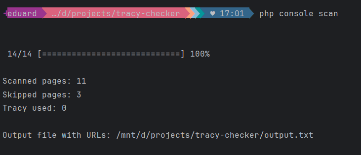

# Console Application for Scanning and Identifying URLs Containing Tracy Debugger on Debug Mode

This PHP console application leverages Symfony's Console component to scan a list of URLs extracted from a CSV file,
filtering and identifying those containing Tracy Debugger on debug mode.



Scanner sleeps for 1 second after each request to avoid overloading the server.

## Installation

1. Clone the repository or download the source code.
2. Navigate to the project directory.
3. Run the following command to install the required dependencies via Composer:

    ```bash
    composer install
    ```

## Usage

* Prepare a CSV file named input.csv containing a list of URLs to be scanned.
* Execute the application using the command-line interface:

   ```bash
   php console scan
   ```

## Description

The application performs the following tasks:

- Reads a CSV file named input.csv containing a list of URLs.
- Filters and extracts valid URLs from the CSV file.
- Iterates through each URL and fetches its HTML content.
- Searches for a specific content identifier ('Tracy' in this case) within the HTML content.
- Appends the URLs containing the specified content to an output.txt file.
- Displays progress using a progress bar.
- Once the scanning process completes, the application outputs the following information:
    - Total scanned pages: [number]
    - Pages with the specified content: [number]
    - Output file with identified URLs: [outputFile]

## Requirements

- PHP 8.0 or higher
- Composer

## Sponsor

This project is sponsored by [Beneš & Michl](https://www.benes-michl.cz/).

## License

This project is licensed under the MIT License.

## Credits

This application was developed by Eduard Štůla, head of the web development department
at [Beneš & Michl](https://www.benes-michl.cz/).